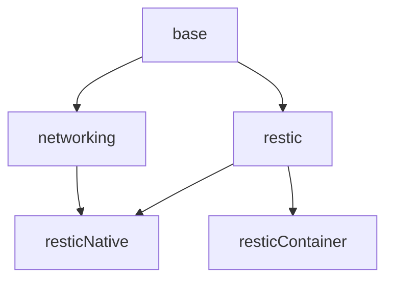

# Backup Server Image

Using [restic/rest-server](https://github.com/restic/rest-server)

## Features

`resticNative` uses a plain go binary of `restic/rest-server`

`resticContainer` uses a container of `restic/rest-server`



## Build

Pick one of the features, based on your preference:

```
./build resticNative
./build resticContainer
```
